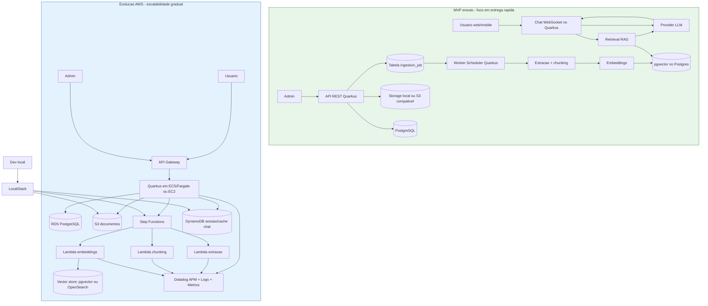

# Arquitetura - MVP Enxuto e Evolucao AWS

## 1) Objetivo
Registrar o desenho arquitetural em 2 etapas:
- Entrega inicial simples (MVP).
- Evolucao gradual com servicos AWS (Lambda, DynamoDB, Step Functions).

## 2) Diagrama

## 3) Leitura do desenho

### 3.1 MVP enxuto
- Quarkus concentra API admin, chat e worker de ingestao.
- Fila simples por tabela `ingestion_job` no Postgres.
- Vetor store no mesmo banco com `pgvector`.
- Menor custo operacional para validar o produto.

### 3.2 Evolucao AWS
- Quarkus continua como servico central de negocio.
- Ingestao pesada vai para Step Functions + Lambdas.
- S3 armazena documentos e DynamoDB guarda sessao/cache de chat.
- Observabilidade no Datadog para backend e funcoes serverless.

### 3.3 LocalStack primeiro
- Em desenvolvimento: simular S3, Step Functions e DynamoDB.
- Em producao: migrar para AWS real no Free Tier com limites e alarmes de custo.

## 4) Quando migrar para AWS
- Aumentou volume de ingestao ou tempo medio por job.
- Worker interno comecou a competir com latencia da API.
- Necessidade de retries mais robustos e orquestracao por etapas.
- Necessidade de escalar partes especificas sem escalar tudo.

## 5) Ordem sugerida de adocao
1. S3 para armazenamento de documentos.
2. Step Functions para orquestrar pipeline.
3. Lambda para extracao/chunking/embedding.
4. DynamoDB para sessao/cache de chat.
5. Ajustes de custo, observabilidade e governanca.
